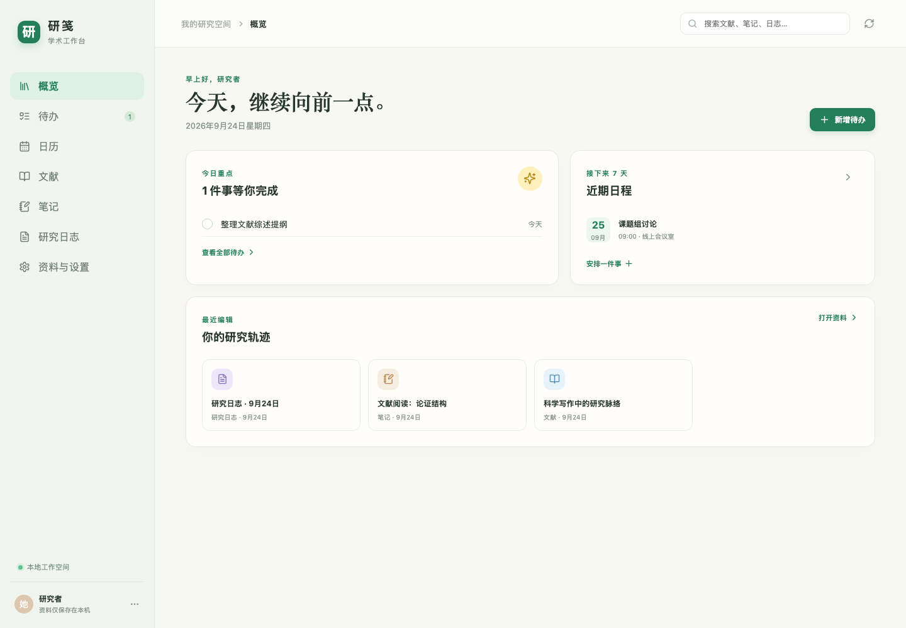

<div align="center">

<h1>研笺</h1>

<h3>个人学术工作台 · 把文献、思考与下一步，安放在一处。</h3>

<p>本地优先的科研空间，面向 Windows 11 上的博士生个人使用。</p>

<p>
  <a href="https://github.com/maxma615/yanjian-academic-workbench/stargazers"></a>
  <a href="https://github.com/maxma615/yanjian-academic-workbench/network/members"></a>
  <a href="LICENSE"></a>
  <a href="https://nodejs.org/"></a>
</p>

<p></p>

<sub>界面截图使用虚构演示资料；公开代码仓库不包含个人科研资料。</sub>

</div>

## 在一个地方，接着做研究

研笺把文献、PDF、Markdown 笔记、研究日志、待办和日历放进同一个个人工作流。资料保存在自己的电脑上；GitHub 只是可选的文本同步通道，不是使用研笺的前提。

| 📚 研究资料 | ✍️ 连续思考 | 🗓️ 下一步行动 | 🧰 自己掌握资料 |
| --- | --- | --- | --- |
| 文献元数据、标签与本地 PDF | 笔记和研究日志保留为 Markdown | 待办、截止日期与研究日历 | 可重建索引、完整备份与空目录恢复 |

### 本地优先，边界清楚

- 资料保存在系统应用数据目录，代码目录只放程序、依赖和测试数据。
- 笔记和日志使用 Markdown，文献、待办与日历使用 JSON；SQLite 只负责可重建的搜索索引。
- 应用提供完整备份和受校验的恢复流程，恢复目标必须为空目录。
- 可选 GitHub 同步仅面向笔记、研究日志、文献元数据及必要的冲突/删除文本。PDF、待办、日历、凭据和完整备份不会上传。
- GitHub 同步默认关闭；连接时需要用户指定专用私人仓库，并明确确认同步范围。

## 快速开始

需要 Node.js 24 或更新版本。

```sh
npm ci --cache .npm-cache
npm run dev
```

开发预览默认运行在 `http://127.0.0.1:5178`，首次启动会在本应用目录创建隔离的开发资料。端口占用时，研笺会选择其他端口并打印实际地址。

需要运行桌面壳时：

```sh
npm run desktop:dev
```

`npm run test` 和 `npm run build` 可运行单元测试与生产构建。端到端测试、桌面打包和 Windows 目标机检查详见[桌面构建说明](docs/desktop-build.md)及[Windows 11 验收交接](docs/acceptance/windows-handoff.md)。

## 当前状态

| 能力 | 状态 |
| --- | --- |
| 本地工作区、资料编辑、索引、备份与恢复 | 已实现 |
| Electron 桌面主进程、原生文件操作与加密凭据保存 | 已实现 |
| GitHub 文本资料同步 | 可选；默认关闭，真实私人资料仓库演练待完成 |
| Windows 11 实机验收 | 待在目标设备执行；当前 Mac 构建不能代替 Windows 验收 |

当前记录中，单元测试为 **113 项 / 19 个测试文件**，`npm run build` 通过。不同设备、安装权限和 Windows 原生文件关联仍需按[平台验收矩阵](docs/acceptance/platform-matrix.md)逐项实测；本仓库不宣称 Windows 11 已验收。

## 设计与数据说明

- 应用为独立本地工作区，不需要情侣生活空间的账号或服务。
- Electron 桌面版本将资料放入操作系统的应用数据目录。Windows 通常位于 `%APPDATA%/YanJian/data/`；浏览器预览与桌面应用使用不同的默认目录。
- 同一资料目录只允许一个可写实例。保存、索引重建、备份与恢复有明确的状态和错误反馈。
- 备份包含本地 PDF 和删除/冲突恢复资料，但不包含同步凭据、缓存或派生索引。

## 项目文档

- [平台与工作流决策](docs/decisions/0001-platform-workflow.md)
- [Windows 11 实机交接](docs/acceptance/windows-handoff.md)
- [平台与数据验收矩阵](docs/acceptance/platform-matrix.md)
- [实现记录](docs/implementation-progress.md)
- [桌面与 GitHub 同步记录](docs/desktop-sync-progress.md)

## Star History

[](https://www.star-history.com/#maxma615/yanjian-academic-workbench&Date)

## License

[MIT](LICENSE) © 2026 研笺 contributors. 第三方依赖及其他第三方内容仍受其各自许可证约束。
